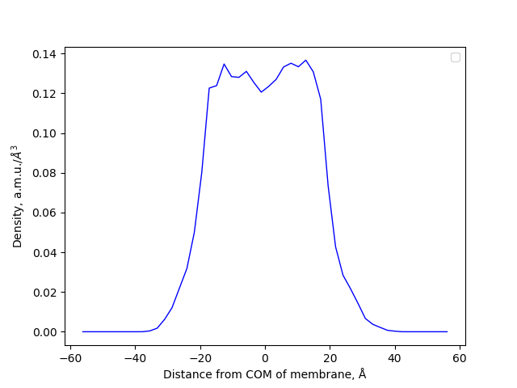
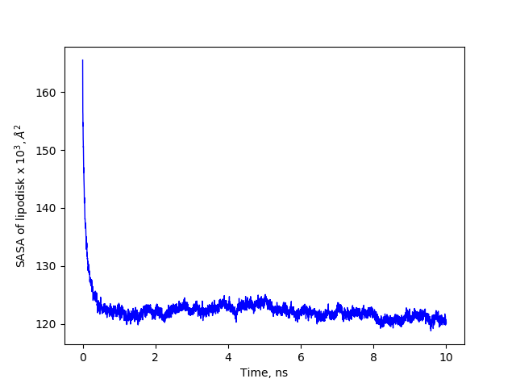
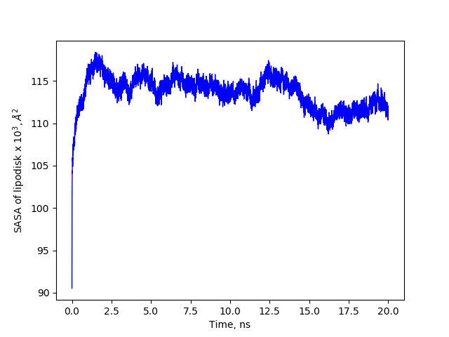
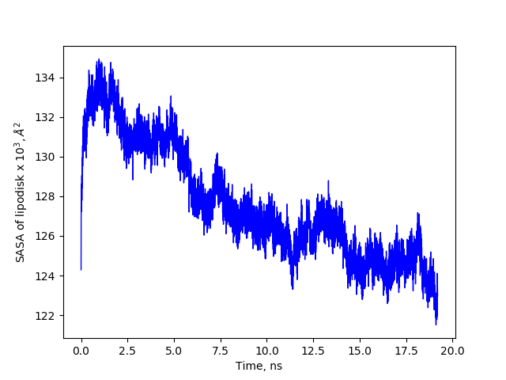
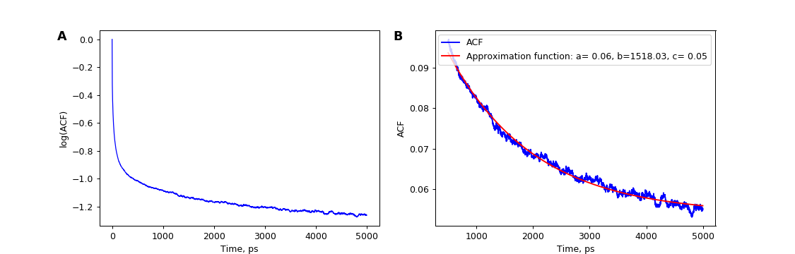
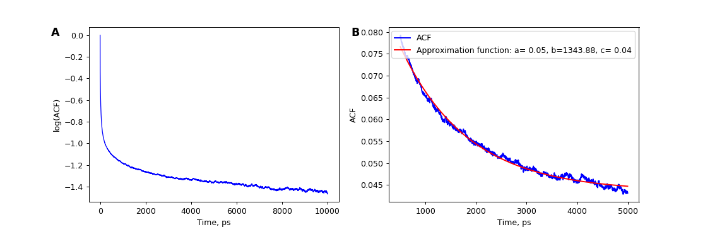
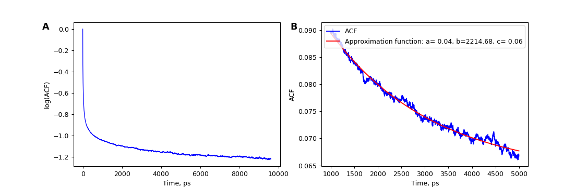
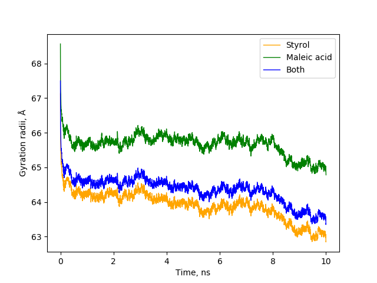
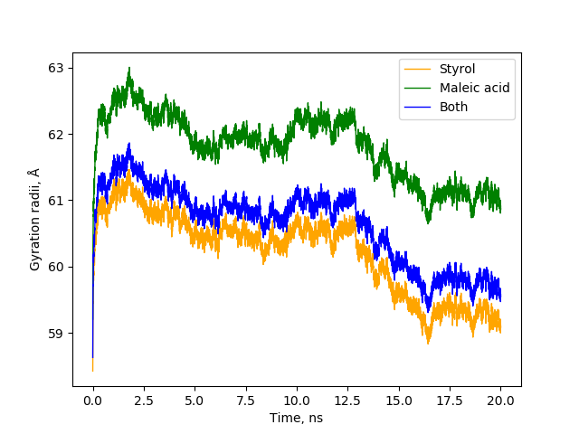
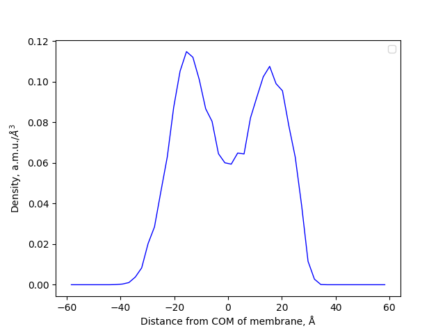

# Lab journal

### 17.01.20 Friday
#### Preparation of 1h2s_DIBMALP starting configuration
Steered MD with force constant 150 kJ mol*-1 nm*-2.

### 16.01.20 Thursday
#### Preparation of noprot_DIBMALP starting configuration
Steered MD with force constant 150 kJ mol*-1 nm*-2.

### 14.10.19 Monday
#### Comparison of DIBMALP and SMALP
1. Overview.

|  | SMA | DIBMA |
|:---:|:---:|:---:|
| with protein |<p align="center">  </p> | NA |
| without protein | 6 | -0.5 |

2. SASA.

|  | SMA | DIBMA |
|:---:|:---:|:---:|
| with protein | <p align="center">  </p> | NA |
| without protein | <p align="center">   </p> | <p align="center">   </p> |

3. Rotational time.

|  | SMA | DIBMA |
|:---:|:---:|:---:|
| with protein | <p align="center">   </p> | NA |
| without protein | <p align="center">   </p> | <p align="center">   </p> |

4. Gyration radii.

|  | SMA | DIBMA |
|:---:|:---:|:---:|
| with protein | <p align="center">  </p> | NA |
| without protein | <p align="center">  </p> | <p align="center">  </p> |

### 12.09.19 Thursday
#### Prepared files for start of long simulation of 13 nm SMALP with no protein. Charge dependence of APL.
Longer simulations are required than those carried out previously. And also SMALP is bigger (13 nm in diameter vs. 9 nm before).

### 10.09.19 Tuesday
#### 10 a.m. - Start of 1h2s simulation in DIBMALP. 4 p.m. - nvt ended (200k steps). Finally failed (wrong polymer).

### 09.09.19 Monday
#### Preparation of 1h2s simulation in DIBMALP.
#### Analysis of trajectory of SMALP with no protein in it.
1. Lipid density versus thickness.
<p align="center">
  
</p>

2. SASA versus time.
<p align="center">
  
</p>

3. Gyration radii of Maleic acid monomers, Styrol monomers and both versus time.
<p align="center">
  
</p>

4. Rotational ACF of myristoil atoms C11 C12 C13 (as template POPC where C15 C16 C17 were chosen in previous calculations).
<p align="center">
  
</p>

### 06.08.19 Tuesday
#### Supercomputer access endeavours
Generation of key:

`ssh-keygen -t rsa -b 2048 -C 'mgu-tarasovk49' -f ~/.ssh/mgu`

Change access permissions `chmod 600 ~/.ssh/mgu`.

Copy public key from *~/.ssh/mgu.pub* to https://users.parallel.ru/ > Профиль > ssh-ключи.

Create *~/.ssh/config* with private key:

```
Host lomonosov
HostName lomonosov.parallel.ru
User tarasovk49_1869
IdentityFile ~/.ssh/mgu
```
Now you can access Lomonosov with `ssh lomonosov`. *~/lomonosov/* for such purposes.

The rules of supercomputer calculations https://parallel.ru/cluster/rules.

### 03.08.19 Saturday
#### Uploaded and partially rewritten [`nodoublemal.py`](polymers_preparation/nodoublemal.py).
Added option to build DIBMA sequences with that script.
#### Work in construction zone

### 02.08.19 Friday
#### Completely rewritten [`polymer_generation.py`](polymers_preparation/polymer_generation.py).
It now has friendly inteface and also there are three ways to build polymer molecules: 
1. Generate random polymer molecules.
2. Generate polymer molecules from txt file.
3. Generate polymer molecules from manually submitted sequences.

### 01.08.19 Thursday
#### Analysis of trajectory 1h2s in DMPC layer of ~11\*11 nm^2. Whole system size is 20\*20\*12 nm^3.
Generated index file with groups needed for analysis:
```
gmx_2018 make_ndx -f lipodisk_npt.tpr<<EOF
a C211 | a C212 | a C213
name 28 C11-C12-C13-myristoil
r MAL | r MAR | r MA2 | r MAD
a CA | a CB
29 & 30
name 31 MA_backbone
r ST1 | r ST2
32 & 30
name 33 ST_backbone
33 | 31
name 34 both_backbone
!27
name 35 except_wat_and_ions
q
EOF
```

C11-C12-C13-myristoil is a group for ACF calculation

MA_backbone, ST_backbone, both_backbone are groups for gyration radii calculation

except_wat_and_ions is a group for SASA calculation

**Plots:**
1. Lipid density versus thickness.
```
gmx_2018 density -f lipodisk_npt.xtc -s lipodisk_npt.tpr -n index.ndx -o lipid_density.xvg -dt 10000 -center -d Z#<<!
DMPC
DMPC
!
python density_profile.py
```
<p align="center">
  
</p>

2. SASA versus time.
```
gmx_2018 sasa -f lipodisk_npt.xtc -n index.ndx -s lipodisk_npt.tpr -o sasa.xvg<<!
except_wat_and_ions
!
python sasa.py
```
<p align="center">
  
</p>

3. Gyration radii of Maleic acid monomers, Styrol monomers and both versus time.
```
gmx_2018 gyrate -f lipodisk_npt.xtc -s lipodisk_npt.tpr -n index.ndx -o MA_gyr.xvg<<!
MA_backbone
!
gmx_2018 gyrate -f lipodisk_npt.xtc -s lipodisk_npt.tpr -n index.ndx -o ST_gyr.xvg<<!
ST_backbone
!
gmx_2018 gyrate -f lipodisk_npt.xtc -s lipodisk_npt.tpr -n index.ndx -o both_gyr.xvg<<!
both_backbone
!
python gyration_radii.py
```
<p align="center">
  
</p>

4. Rotational ACF of myristoil atoms C11 C12 C13 (as template POPC where C15 C16 C17 were chosen in previous calculations).
```
gmx_2018 rotacf -f lipodisk_npt.xtc -s lipodisk_npt.tpr -n index.ndx -o lipodisk_rotacf.xvg -P 2<<!
C11-C12-C13-myristoil
!
python acf_fit.py
```
<p align="center">
  
</p>


#### Uploaded 2 complete algorithms to [Scratch.md](Scratch.md)
1. Charge dependence simulation.
2. Sensory rhodopsin 1h2s preparation and simulation from the very beginning.
