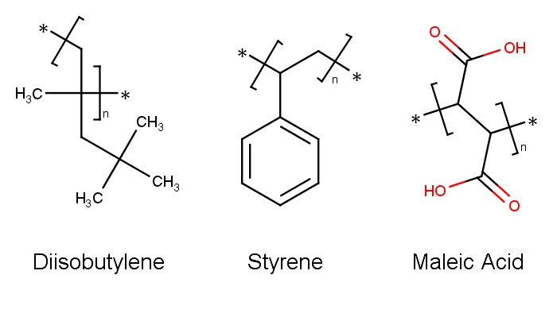

# Lipodisk_md

### Overview
**Lipodisk_md** contains assembly and analysis scripts to perform GROMACS simulations of lipodisks. Lipodisk is a membrane system for extracting and studing membrane proteins. It comprises a part of lipid membrane with or without membrane protein in it which is stabilized on ridges by amphiphilic polymers. Usually SMA (Styrene and Maleic Acid copolymer) and DIBMA (Diisobutylene and Maleic Acid copolymer) polymers are used for lipodisk production. Lipodisks formed with SMA and DIBMA are therefore called SMALPs and DIBMALPs. **Lipodisk_md** allows to:

1. Build polymer molecules using [Pysimm](https://github.com/Tarasovk49/pysimm) consisting of 3 types of monomers: Maleic acid, Diisobutylene, Styrene.

  

2. Generate topology files with command *pdb2gmx* for systems, containing 5 types of lipids (POPC, DOPC, DPPC, CHOL, DMPC) and polymer molecules. Topologies for lipids were taken from papers [1](https://www.ncbi.nlm.nih.gov/pubmed/26568975), [2](https://www.ncbi.nlm.nih.gov/pubmed/24745688), [3](https://www.ncbi.nlm.nih.gov/pubmed/26187855). DMPC topology was obtained by cutting DPPC topology. Membranes used in here were obtained via [CHARMM-GUI Membrane Builder](http://www.charmm-gui.org/?doc=input/membrane.bilayer) service.
3. Produce starting configuration for [Gromacs](http://www.gromacs.org/) simulations using [MDAnalysis](https://github.com/MDAnalysis/mdanalysis) Python library. There are examples of preparation for both models of lipodisk with or without membrane protein (Sensory rhodopsin II-transducer complex [1H2S](https://www.rcsb.org/structure/1h2s) structure was chosen as an example).
4. Prepare all necessary files for steered molecular dynamics to move polymer molecules towards membrane, equilibration of obtained model.
5. Perform analysis of trajectories.

### Dependencies
1. python 3.6.
2. [Pysimm](https://github.com/Tarasovk49/pysimm) - branch with modified files to read atom names from *.mol2* files and write them (along with resids and resnames) to *.pdb* files. LAMMPS installation also required (see Pysimm [installation guide](https://github.com/Tarasovk49/pysimm#complete-installation-pysimm-and-lammps)).
3. [MDAnalysis](https://github.com/MDAnalysis/mdanalysis).
4. [Gromacs](http://manual.gromacs.org/documentation/). All calculations except for production NPT run were carried out with Gromacs 2018.1, production NPT calculations were carried out with Gromacs 2020.1.

### NOTE
For all Gromacs simulations use the forcefield provided (*oplsaa_lipids_polymers.ff* and *residuetypes.dat*). It contains topologies for polymers, lipids (POPC, DOPC, DPPC, CHOL, DMPC), and lys+retinal (REK) residue of rhodopsins.
