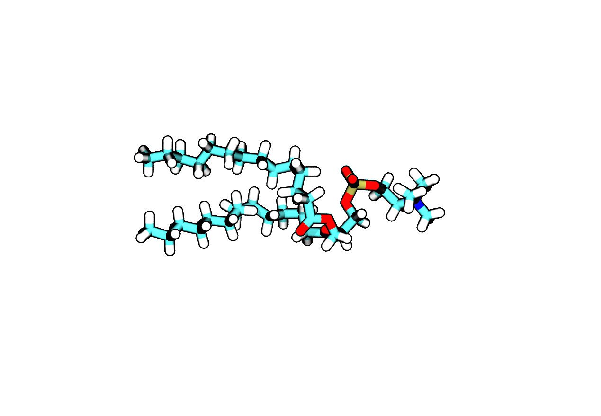
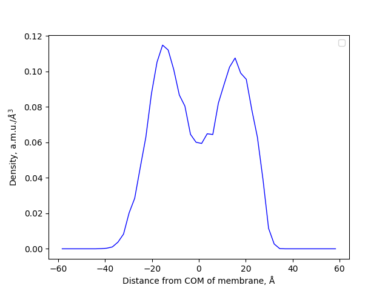
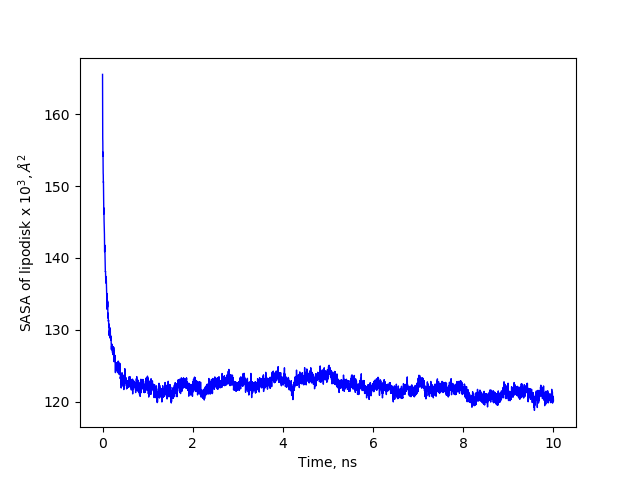
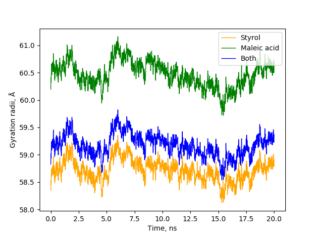
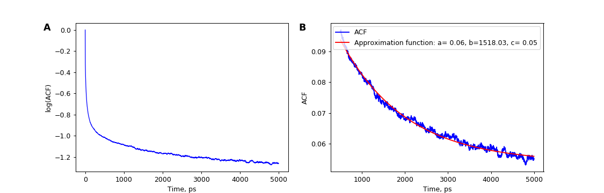

# This is scratch document for algorithms, plots, logs and everything else that can be useful.

## Obtain charge dependence of Area Per Lipid in lipodisks.
Charge on Maleic acid monomers changes from -2 to 0. 

1. Obtain starting configuration from previous 14 ns run of SMALP simulation.
```
gmx_2018 trjconv -f ../../SMA_lipodisk/lipodisk_simulation_noforces_ring_solv/SMALP_14ns.xtc -s ../../SMA_lipodisk/lipodisk_simulation_noforces_ring_solv/SMALP_noforces_solv.tpr -pbc cluster -o SMALP_14ns.pdb -dump 14000<<!
1
0
!
```
2. **For -2 SMALP were run:**

Cut everything except polymers and write them to another file. Generate new pdb with pdb2gmx option `-ignh` and merge two files together.
```
sed -i 's/MAL/MAD/g' SMALP_14ns.pdb
cp SMALP_14ns.pdb polymers.pdb
cat SMALP_14ns.pdb | grep POPC > no_pol.pdb
cat SMALP_14ns.pdb | grep SOL >> no_pol.pdb
cat SMALP_14ns.pdb | grep NA >> no_pol.pdb
cat SMALP_14ns.pdb | grep CL >> no_pol.pdb
sed -i '/POPC/d' polymers.pdb
sed -i '/NA/d' polymers.pdb
sed -i '/CL/d' polymers.pdb
sed -i '/SOL/d' polymers.pdb

gmx_2018 pdb2gmx -f polymers.pdb -o polymers_new.pdb -ff oplsaa_lipids_polymers -water spce -ignh

rm *Protein*
rm topol.top
python renumber_atoms.py -i polymers_new.pdb -e no_pol.pdb -o SMALP_merged.pdb
python add_ter_between_chains.py -i SMALP_merged.pdb -o SMALP_merged_ter.pdb
```

Then classic way of EM, NVT, NPT 1 ns.

```
gmx_2018 pdb2gmx -f SMALP_merged_ter.pdb -o SMALP_processed.gro -ff oplsaa_lipids_polymers -water spce -p topol.top
.......
```
**For -1.7, -1.2, -1.0, -0.5 charge starting from *SMALP_merged_ter.pdb***
*substitute.py* substitutes the MAD record with MA2, MAL, MAR or MAD.
Table of frequencies:

| 1 | pH | Z | MA2 | MAL | MAR | MAD |
|:---:|:---:|:---:|:---:|:---:|:---:|:---:|
| 1 | 5 | -0.3 | 0.7 | 0.15 | 0.15 | - |
| 2 | 6 | -0.5 | 0.5 | 0.25 | 0.25 | - |
| 3 | 7 | -1.0 | - | 0.5 | 0.5 | - |
| 4 | 8 | -1.2 | - | 0.4 | 0.4 | 0.2 |
| 5 | 9 | -1.7 | - | 0.15 | 0.15 | 0.7 |
| 6 | 10 | -1.9 | - | 0.05 | 0.05 | 0.9 |
| 7 | >10 | -2.0 | - | - | - | 1 |

```
python substitute.py -i SMALP_merged_ter.pdb -o SMALP_half.pdb
```
Then same thing that in -2 charge case:
```
cp SMALP_half.pdb polymers.pdb
cat SMALP_half.pdb | grep POPC > no_pol.pdb
cat SMALP_half.pdb | grep SOL >> no_pol.pdb
cat SMALP_half.pdb | grep NA >> no_pol.pdb
cat SMALP_half.pdb | grep CL >> no_pol.pdb
sed -i '/POPC/d' polymers.pdb
sed -i '/NA/d' polymers.pdb
sed -i '/CL/d' polymers.pdb
sed -i '/SOL/d' polymers.pdb

gmx_2018 pdb2gmx -f polymers.pdb -o polymers_new.pdb -ff oplsaa_lipids_polymers -water spce -ignh

rm *Protein*
rm topol.top
python renumber_atoms.py -i polymers_new.pdb -e no_pol.pdb -o SMALP_fin.pdb
python add_ter_between_chains.py -i SMALP_fin.pdb -o SMALP_fin_ter.pdb

gmx_2018 pdb2gmx -f SMALP_fin_ter.pdb -o SMALP_processed.gro -ff oplsaa_lipids_polymers -water spce -p topol.top
......
```
**For 0 charge**

Substitution is performed with `sed` without *substitute.py*.

```
sed -i 's/MAD/MA2/g' SMALP_merged_ter.pdb
cp SMALP_merged_ter.pdb SMALP_half.pdb
cp SMALP_half.pdb polymers.pdb
cat SMALP_half.pdb | grep POPC > no_pol.pdb
cat SMALP_half.pdb | grep SOL >> no_pol.pdb
cat SMALP_half.pdb | grep NA >> no_pol.pdb
cat SMALP_half.pdb | grep CL >> no_pol.pdb
sed -i '/POPC/d' polymers.pdb
sed -i '/NA/d' polymers.pdb
sed -i '/CL/d' polymers.pdb
sed -i '/SOL/d' polymers.pdb

gmx_2018 pdb2gmx -f polymers.pdb -o polymers_new.pdb -ff oplsaa_lipids_polymers -water spce -ignh

rm *Protein*
rm topol.top
python renumber_atoms.py -i polymers_new.pdb -e no_pol.pdb -o SMALP_fin.pdb
python add_ter_between_chains.py -i SMALP_fin.pdb -o SMALP_fin_ter.pdb

gmx_2018 pdb2gmx -f SMALP_fin_ter.pdb -o SMALP_processed.gro -ff oplsaa_lipids_polymers -water spce -p topol.top
........
```
3. After 1 ns simulations [APL\@Voro](https://sourceforge.net/projects/aplvoro2/) were used to generate area.xvg files with area for each Voronoi tile. Tiles were chosen by phosphorus atom in each lipid. Two .xvg files were obtained for each simulation (0, -0.5, -1.0, -1.2, -1.7, -2.0) representing lower and upper leaflets of lipids. *APL_plot.py* for APL plots:

|Lower leaflet|Upper leaflet|
|----|----|
|||

## Prepare lipodisk with sensory rhodopsin in DMPC.
1. Prepare topology for DMPC. Cut down the DPPC by two atoms on each chain - C215, C216, C315, C316. Delete all bonded interactions from *lipids.rtp*.
<p align="center">
  
</p>
2. Prepare topology for Retinal-lysine (residue REK).

* Upload retinal with hydrogenes linked to C15 to [TTPMKTOP](http://erg.biophys.msu.ru/erg/tpp/). Manually change some atom names and charges according to alkane and alkene atomname specifications.

* Manually modify *ffbonded.itp*. Add specific angles and dihedrals which are absent in normal opls-aa forcefield. The parameters for such angles and dihedrals were chosen corresponding to alkane and alkene topology specifications. The lines added can be seen below.

**Angles**
```
; Retinal+lysine
  C=      C     NC      1   116.000    585.760   ; wlj
  CT     NC      C      1   118.600    585.760   ; 
  C=     C=     C=      1   124.000    585.760   ; wlj
  C=     CT     CT      1   116.000    585.760   ; wlj
  C=     C=      C      1   124.000    585.760   ; wlj
```
**Dihedrals**
```
; Retinal+lysine
  HC     CT     CT     NC      3      5.77183  -2.67148   0.95814  -4.05848   0.00000   0.00000 ; 
  CT     CT     NC     C       3      3.80117  -6.95172  -1.01671   4.16726   0.00000   0.00000 ; 
  HC     CT     NC     C       3      3.80117  -6.95172  -1.01671   4.16726   0.00000   0.00000 ; JUST COPIED FROM C-C-N-C!
  CT     NC      C     C=      3     58.57600   0.00000 -58.57600   0.00000   0.00000   0.00000 ; imine 
  CT     NC      C     HC      3      3.80117  -6.95172  -1.01671   4.16726   0.00000   0.00000 ; JUST COPIED FROM C-C-N-C!
  CT     CM     C=     C=      3      2.92880  -1.46440   0.20920  -1.67360   0.00000   0.00000 ; hydrocarbon all-atom
  C=     CM     CT     HC      3      0.62760   1.88280   0.00000  -2.51040   0.00000   0.00000 ;
  CM     C=     C=     C=      3     58.57600   0.00000 -58.57600   0.00000   0.00000   0.00000 ; alkene
  CT     C=     C=     C=      3     58.57600   0.00000 -58.57600   0.00000   0.00000   0.00000 ; alkene
  CM     C=     CT     CT      3      2.92880  -1.46440   0.20920  -1.67360   0.00000   0.00000 ; hydrocarbon all-atom
  C=     C=     CT     CT      3      2.92880  -1.46440   0.20920  -1.67360   0.00000   0.00000 ; hydrocarbon all-atom
  C=     C=     C=     HC      3     58.57600   0.00000 -58.57600   0.00000   0.00000   0.00000 ; alkene
  C=     C=     C=     C=      3     58.57600   0.00000 -58.57600   0.00000   0.00000   0.00000 ; alkene
  C=     CT     CT     HC      3      0.62760   1.88280   0.00000  -2.51040   0.00000   0.00000 ;
  C=     CT     CT     CT      3      2.92880  -1.46440   0.20920  -1.67360   0.00000   0.00000 ; hydrocarbon all-atom
  C=     C=     C=     C       3     58.57600   0.00000 -58.57600   0.00000   0.00000   0.00000 ; alkene
  CT     C=     C=     C       3     58.57600   0.00000 -58.57600   0.00000   0.00000   0.00000 ; alkene
  C=     C=     CT     HC      3      0.62760   1.88280   0.00000  -2.51040   0.00000   0.00000 ;
  C=     C=     C      NC      3      5.77183  -2.67148   0.95814  -4.05848   0.00000   0.00000 ; 
  C=     C=     C      HC      3      0.62760   1.88280   0.00000  -2.51040   0.00000   0.00000 ;
  HC     C=     C      HC      3      0.62760   1.88280   0.00000  -2.51040   0.00000   0.00000 ; hydrocarbon *new* 11/99
  HC     C=     C      NC      3      5.77183  -2.67148   0.95814  -4.05848   0.00000   0.00000 ; 
```
3. Generate polymer molecules without double Maleic acid monomers along the sequence. The algorithm iterates until the length is less than desired. First M (maleic acid) or S (styrol) is selected as the first monomer with frequencies *pm0* and *ps0*. Then in case S was selected M or S is selected once more and so on until M is selected. In this case on next iteration SM or S is selected with frequencies *psm* and *ps*. In case SM was selected SM or S is selected again and so on until S is selected. Then the algorithm comes to the selection of M and S again. Selections are shown in the picture with ovals. *pm0* and *ps0* are the desired frequencies of Maleic acid and Styrol monomers in polymer molecules. *psm* can be calculated from *pm0 = psm/(ps + 2\*psm)* which is the condition of frequency of maleic acid being inserted with the second oval to represent the desired value of *pm0*. Thus *psm = pm0/(1 - pm0)* and *ps = 1 - psm*. The length of polymer generated by algorithm is either equal or greater by one monomer than the desired. Probability of polymer to have the length one greater is close to *2\*psm/3*, so the initial distribution of length of polymer molecules must have the mean *2\*psm/3* less than the desired to achieve the desired value finally.

<p align="center">
  
</p>
4. Preparation of 1H2S sensory rhodopsin in DMPC membrane.
* Manual merge of LYS 205 and RET 302 in pdb file to REK 205. Deleting all water molecules from pdb. Rename and renumber REK residue to LYR. Correspondence table for renumbering of REK residue:

| LYR | c1 | c2 | c3 | c4 | c5 | c6 | c7 | c8 | c9 | c10 | c11 | c12 | c13 | c14 | c15 | c16 | c17 | c18 | c19 | c80 |
|:---:|:---:|:---:|:---:|:---:|:---:|:---:|:---:|:---:|:---:|:---:|:---:|:---:|:---:|:---:|:---:|:---:|:---:|:---:|:---:|:---:|
| REK | c15 | c14 | c13 | c20 | c12 | c11 | c10 | c19 | c8 | c7 | c6 | c5 | c18 | c4 | c3 | c2 | c1 | c17 | c16 | c9 |
<!-- 
| lyr | rek |
|:---:|:---:|
| c1 | c15 | 
| c2 | c14 |
| c3 | c13 |
| c4 | c20 |
| c5 | c12 |
| c6 | c11 |
| c7 | c10 |
| c8 | c19 |
| c9 | c8 |
| c10 | c7 |
| c11 | c6 |
| c12 | c5 |
| c13 | c18 |
| c14 | c4 |
| c15 | c3 |
| c16 | c2 |
| c17 | c1 |
| c18 | c17 |
| c19 | c16 |
| c80 | c9 | -->
* Duplicate 1h2s monomer using MDAnalysis. Add TER records after each chain of protein.
* Upload 1h2s dimer to CHARMM-GUI Membraine Builder and embed it in 11\*11 nm^2 DMPC bilayer, add water, 0.15 KCL. Download output for Gromacs. Run all steps of minimization and equilibration provided by CHARMM and also 2 ns of NPT simulation.
* Extract last pdb frame from NPT. Rename LYR residue to REK and renumber atoms back. Delete HZ1 atoms because NZ atom of lysine REK was parametrized in OPLS-AA deprotonated. Renumber atoms with *renumber_atoms.py*. Perform a series of `sed` exchange:
```
sed -i 's/HSD /HISD/g' from_charmm.pdb
sed -i 's/HG1 SER/HG  SER/g' from_charmm.pdb
sed -i 's/HB3 REK/HB1 REK/g' from_charmm.pdb
sed -i 's/HG3 REK/HG1 REK/g' from_charmm.pdb
sed -i 's/HD3 REK/HD1 REK/g' from_charmm.pdb
sed -i 's/HE3 REK/HE1 REK/g' from_charmm.pdb
```
Add TER records after each protein chain. Note, that *add_ter_between_chains.py* fails to add TER before DMPC records. You need to add it manually. Delete water, potassium and chlorate ions.

5. Perform equilibrating simulation in OPLS-AA forcefield (fill the box of water, add ions, run EM, NVT with restraints, NPT with restraints, NPT 1 ns).

6. Extract the last frame of trajectory with option `-pbc whole`. Delete CRYST record in the beginning of the extracted pdb.

7. Assemble initial system with `system_assembly.py`. It cuts membrane into round piece and places polymer molecules in the rings round membrane. Add TER records in pdb.

8. Run simulation in vacuum with two virtual walls 2 nm higher and 2 nm lower membrane COM. The forces are applied on polymer molecules which push them towards membrane COM. Restraints on protein and lipids.

9. Run simulation in solvent without forces (EM, NVT with restraints, NPT).

10. Perform analysis. Whole script is `analysis.sh`.
- First we need to generate index file with groups needed for analysis:
```
gmx_2018 make_ndx -f lipodisk_npt.tpr<<EOF
a C211 | a C212 | a C213
name 28 C11-C12-C13-myristoil
r MAL | r MAR | r MA2 | r MAD
a CA | a CB
29 & 30
name 31 MA_backbone
r ST1 | r ST2
32 & 30
name 33 ST_backbone
33 | 31
name 34 both_backbone
!27
name 35 except_wat_and_ions
q
EOF
```
C11-C12-C13-myristoil is a group for ACF calculation

MA_backbone, ST_backbone, both_backbone are groups for gyration radii calculation

except_wat_and_ions is a group for SASA calculation

- Lipid density versus thickness.
```
gmx_2018 density -f lipodisk_npt.xtc -s lipodisk_npt.tpr -n index.ndx -o lipid_density.xvg -dt 10000 -center -d Z#<<!
DMPC
DMPC
!
python density_profile.py
```
<p align="center">
  
</p>
- SASA versus time.
```
gmx_2018 sasa -f lipodisk_npt.xtc -n index.ndx -s lipodisk_npt.tpr -o sasa.xvg<<!
except_wat_and_ions
!
python sasa.py
```
<p align="center">
  
</p>
- Gyration radii of Maleic acid monomers, Styrol monomers and both versus time.
```
gmx_2018 gyrate -f lipodisk_npt.xtc -s lipodisk_npt.tpr -n index.ndx -o MA_gyr.xvg<<!
MA_backbone
!
gmx_2018 gyrate -f lipodisk_npt.xtc -s lipodisk_npt.tpr -n index.ndx -o ST_gyr.xvg<<!
ST_backbone
!
gmx_2018 gyrate -f lipodisk_npt.xtc -s lipodisk_npt.tpr -n index.ndx -o both_gyr.xvg<<!
both_backbone
!
python gyration_radii.py
```
<p align="center">
  
</p>
- Rotational ACF of myristoil atoms C11 C12 C13 (as template POPC where C15 C16 C17 were chosen in previous calculations).
```
gmx_2018 rotacf -f lipodisk_npt.xtc -s lipodisk_npt.tpr -n index.ndx -o lipodisk_rotacf.xvg -P 2<<!
C11-C12-C13-myristoil
!
python acf_fit.py
```
<p align="center">
  
</p>
