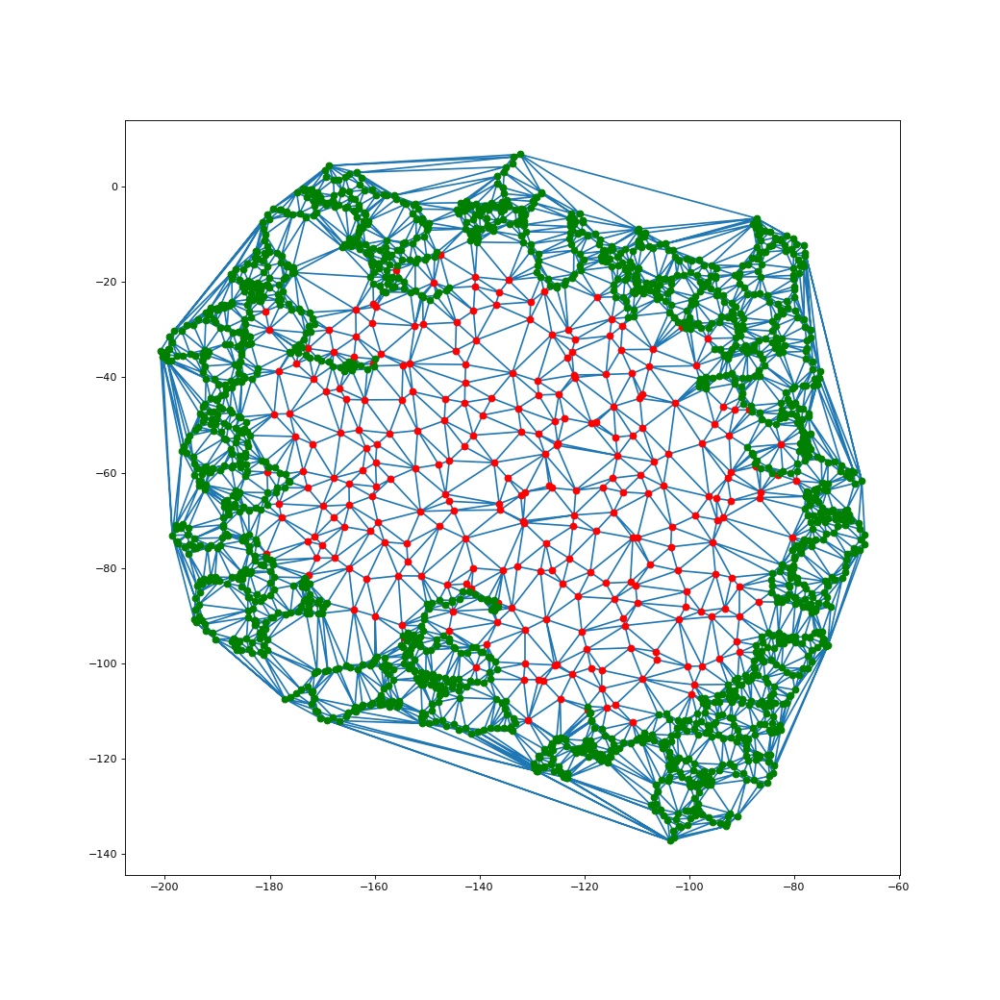
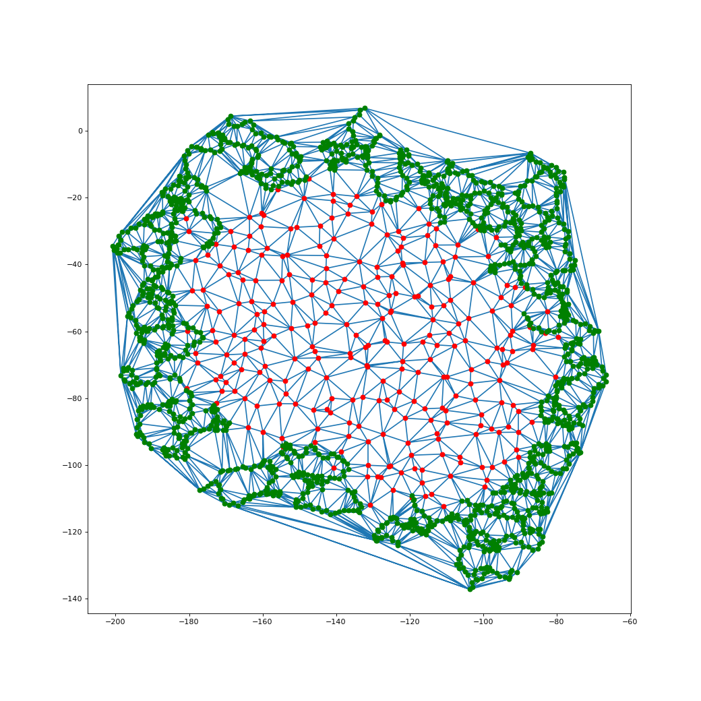
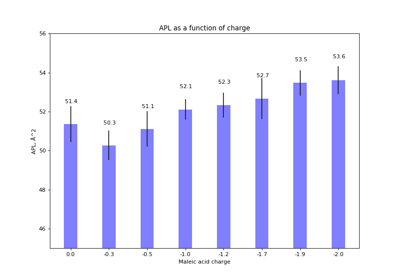
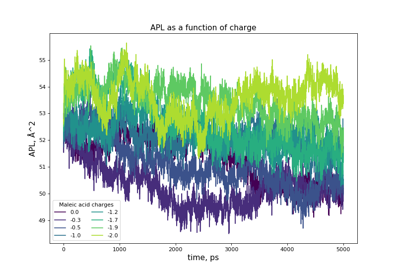
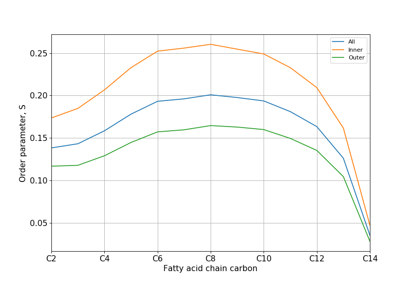

# Description

This directory provides analysis scripts of Gromacs trajectories of lipodisks with example outputs.

### Area per lipid
##### Calculation of area per lipid is provided by two different scripts. Among the output of those scripts there are CSV files with (time, APL) data. [APL_multiple.py](APL_multiple.py) combines those data for set of different maleic acid charge trajectories into a single plot.
1. The first one works much faster and calculates area per lipid for projections of lipids onto a fitted to those lipids plane - [*APL_calculation_planefit.py*](APL_calculation_planefit.py).

`APL_calculation_planefit.py -s (0) --e (1000000) --i (1) --structure (SMALP_ions.gro) --trajectory (SMALP_npt.xtc) --planefit_sel (resname DMPC and name C27) --dots_sel ((resname ST1 ST2 MAL MAR DB1 DB2 MAD MA2 and name CA CB) or (protein and name CA))`

- `-s 0` start frame

- `-e 1000000` end frame

- `-i 1` interval to update fitted plane

- `--structure SMALP_ions.gro` PDB or GRO file

- `--trajectory SMALP_npt.xtc` XTC or TRR file

- `--planefit_sel 'resname DMPC and name C27'` selection of atoms to fit plane, must include only one atom for each lipid as they are used for calculation of area per lipid. In order to get correct APL value you need to multiply that value by the number of atoms used (in case if more than one atom for each lipid is depicted)

- `--dots_sel '(resname ST1 ST2 MAL MAR DB1 DB2 MAD MA2 and name CA CB) or (protein and name CA)'` additional to `--planefit_sel` selection of atoms to calculate Delaunay triangulation

Original [Jupyter notebook](APL_calculation_planefit.ipynb).

Delaunay triangulations with and without hanging over membrane polymer molecules can be seen below. 

|With overhanging polymer molecules|Without overhanging polymer molecules|
|----|----|
|||

2. The other finds projections of lipids onto a fitted to those lipids parabola. That is useful if your membrane bended during the simulation. It is quite normal for membranes with area greater than ~200 nm^2 - [*APL_calculation_parabolafit.py*](APL_calculation_parabolafit.py).

Original [Jupyter notebook](...).

##### Plotting of obtained data is conducted by [APL_multiple.py](APL_multiple.py). It combines data for set of different maleic acid charge trajectories into a single plot.
The default calculations were carried of for models with \[0.0, -0.3, -0.5, -1.0, -1.2, -1.7, -1.9, -2.0\] maleic acid charges. Subdirectories where calculations were carried of have the same names. Original [Jupyter notebook](APL_multiple.ipynb).

|APL vs Maleic acid charge|APL vs time|
|----|----|
|||

### Lipid order parameters

[*LOP_all_atoms.py*](LOP_all_atoms.py) calculates lipid order parameters for each type of lipid fatty acid chain carbon atom - C2, C3, C4, ..., C14. Order parameters are also calculated for three different subsets of lipids - for all lipids, for central (inner) lipids that located at distance more than 2 nm from polymer molecules and peripheral (outer) lipids of lipodisk that located at distance less than 2 nm from polymer molecules.


`LOP_all_atoms.py -s (0) --e (1000000) --i (1) --structure (SMALP_ions.gro) --trajectory (SMALP_npt.xtc) --planefit_sel (resname DMPC and name C27) --dots_sel ((resname ST1 ST2 MAL MAR DB1 DB2 MAD MA2 and name CA CB) or (protein and name CA))`

- `-s 0` start frame in ps

- `-e 1000000` end frame in ps

- `-i 1` interval to update fitted plane in ps

- `--step` Step of integration in fs

- `--structure lipodisk_npt.gro` PDB or GRO file

- `--trajectory lipodisk_npt_2_whole_cluster_nojump_mol.xtc` XTC or TRR file

- `--write_freq` Number of steps that elapse between writing coordinates to output trajectory file

- `--planefit_sel 'not resid 111 106 and resname DMPC and name C27 C37'` selection of atoms to fit plane

[Original Jupyter notebook](LOP_all_atoms.ipynb) is also available.



### Rotational correlation time of lipids

Rotational correlation time of lipids is the time for autocorrelation function *1.5\*cos^2(theta)-0.5* to be reduced by *e* times. It can be measured in NMR and ESR relaxation experiments. Trajectory analysis is conducted in three steps - preparing index files with groups of atoms to be analysed, calculating autocorrelation functions for those groups specified, fitting of obtained plots with two exponents.

Fitting function:
`ACF_fit = (1 - S^2)(w1\*exp(-t/tau1) + w2\*exp(-t/tau2)) + S^2`, where `S` is lipid order parameter calculated earlier

Resulting tau is:
`tau = w1\*tau1 + w2\*tau2`

[make_ndx_rotacf.py](make_ndx_rotacf.py) prepares index file with three groups: all lipids, inner and outer lipids. Those groups specify C12 H121 H122 atoms. ACF is calculated for 2nd Legandre polynom of vector C12H121 x C12H122.

Calculation of ACF via Gromacs:
```
gmx rotacf -f lipodisk_npt_2_whole_cluster_nojump_mol.xtc -s lipodisk_npt_2.tpr -n index_edge.ndx -o lipodisk_rotacf_edge.xvg -P 2
gmx rotacf -f lipodisk_npt_2_whole_cluster_nojump_mol.xtc -s lipodisk_npt_2.tpr -n index_center.ndx -o lipodisk_rotacf_center.xvg -P 2
gmx rotacf -f lipodisk_npt_2_whole_cluster_nojump_mol.xtc -s lipodisk_npt_2.tpr -n index_all_lipids.ndx -o lipodisk_rotacf_all.xvg -P 2
```
[acf_fit.py](acf_fit.py) fits ACFs with two exponent function. Order parameters for C12 are taken from CSV generated during LOP analysis earlier.

### Gyration radii of polymer molecules

### Ions distribution along normal to membrane and maybe sth else????

### Polymer density along normal to membrane

### ???????
