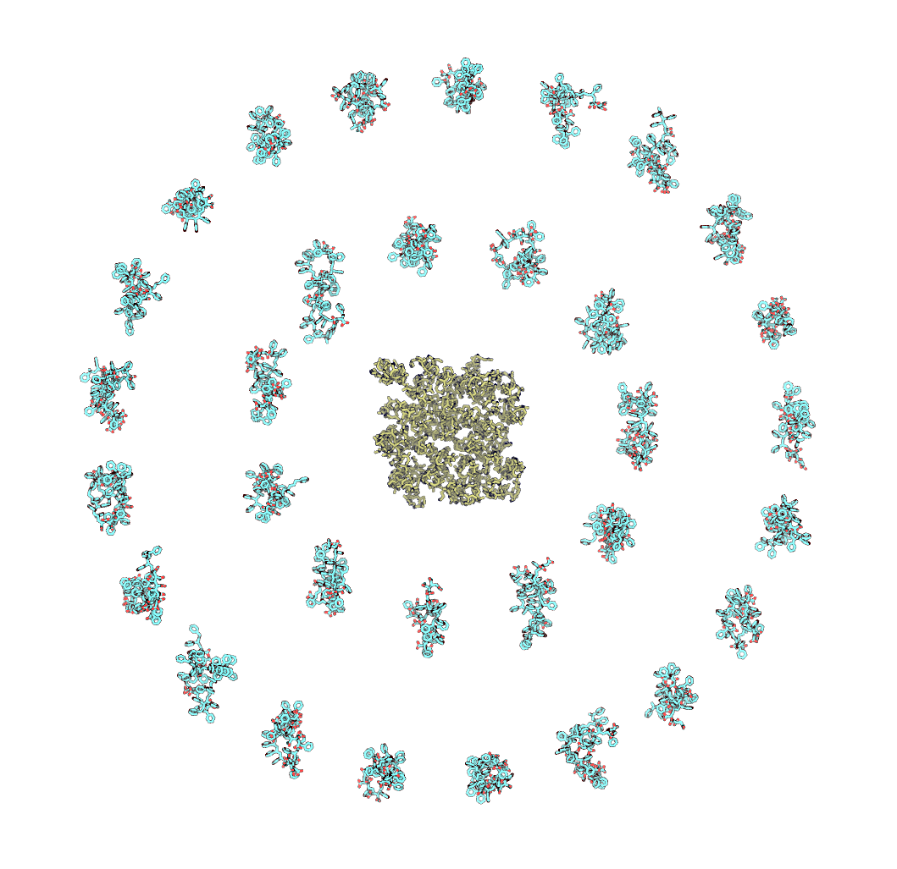

# Description

***orient_poly.py*** places polymer molecules in rings around lipid membrane ridges. **-n** specifies the number of rings.
```
python orient_poly.py -m membrane.pdb -p directory_polymer_molecules_reside -o outfile_name.pdb -n 2 --r_coeff 1.0 --angle_coeff 2.0
```
There are two coefficients **--r_coeff** and **--angle_coeff** to control density of polymer placing. *r_coeff = 1.0* and *angle_coeff = 2.0* are **the least** values when it is garanteed that none of the polymer molecules overlap. Decrease these coefficients to pack polymer molecules with higher density but always check the conformation obtained because overlapping may occur.

<p align="center">
  
</p>

*add_ter_between_chains.py* adds TER strings in *.pdb* files between different chains.
```
python add_ter_between_chains.py -i infile_name.pdb -o outfile_name.pdb
```
