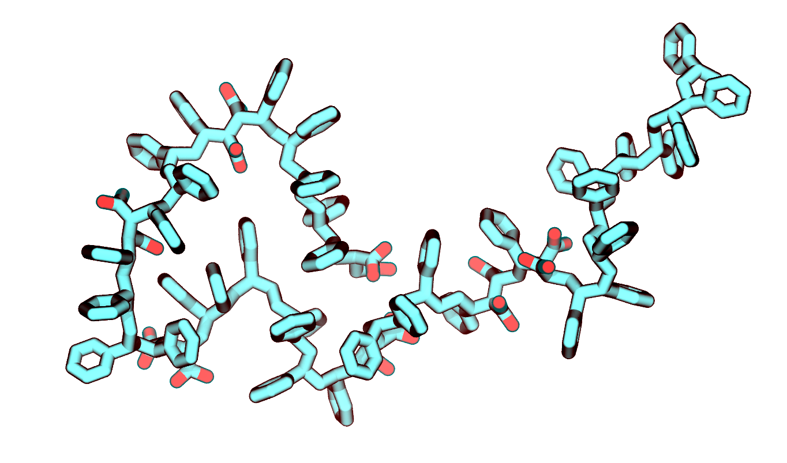
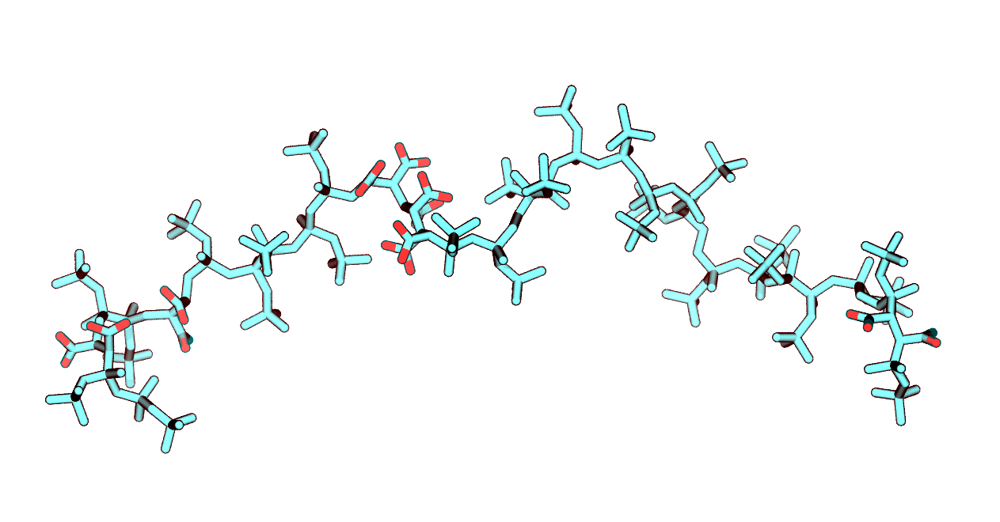

# Description

[***nodoublemal.py***](nodoublemal.py) generates txt file with sequences of SMA copolymer - each string comprises sequence of one polymer molecule.

`nodoublemal.py -n 100 --length 36 --rmsd 3 --out_filename sequences.txt --pm 0.25 --ph 0.75 --polymer sma`

The options provided are (with defaults):

- `-n 100` number of polymers to be generated

- `--length 36` mean length of polymer molecule in monomers

- `--rmsd 3` RMSD of lengths of polymer molecules in monomers

- `--out_filename sequences.txt` name of generated file with sequences

- `--pm 0.25` occurence of Maleic acid monomer

- `--ph 0.75` occurence of Hydrophobic monomer (Diisobutylene or Styrol)

- `--polymer sma` wished polymer - DIBMA (Diisobutylene-Maleic acid copolymer) or SMA (Styrene--Maleic acid copolymer)


[***polymer_generation.py***](polymer_generation.py) builds polymer molecules consisting of diisobutylene, maleic acid, styrene monomers. 8 types of monomers are provided by *topology_generalized/.mol*:
- 4 types of maleic acid monomers = (2 states of protonation (protonated/deprotonated)) x (2 different carboxyl groups of maleic acid (left/right)),
- 2 types of diisobutylene monomers with radical group on the left/right side,
- 2 types of styrene monomers with benzene group on the left/right side.

The syntax is (with defaults):

`polymer_generation.py -n 100 --length 36 --rmsd 3 --protstate 3 --ps 0.75 --pm 0.25 --pd 0.0 --random yes --seq_file not_specified --dir_name polymer_molecules --out_filename polymer`

The options provided are (with defaults):

- `-n 100` number of polymers to be generated. Is taken into account only with '--random'='yes'

- `--length 36` mean length of polymer molecule in monomers. Is taken into account only with '--random'='yes'

- `--rmsd 3` RMSD of lengths of polymer molecules in monomers. Is taken into account only with '--random'='yes'

- `--protstate 3` Protonation state defines the mean charge on maleic acid carboxyl groups. Correspondence of protonation state, pH value and mean charge of MA monomer is given by table:

| Protstate   | 1 | 2 | 3 | 4 | 5 | 6 | 7 |
|:---|:---:|:---:|:---:|:---:|:---:|:---:|:---:|
| pH  | 5 | 6 | 7 | 8 | 9 | 10 | >10 |
| charge | -0.3 | -0.5 | -1.0 | -1.2 | -1.7 | -1.9 | -2.0 |

- `--pm 0.25` Occurrence of maleic acid monomer. Is taken into account only with '--random'='yes'

- `--pd 0.0` Occurrence of diisobutylene monomer. Is taken into account only with '--random'='yes'

- `--ps 0.75` Occurrence of styrene monomer. Is taken into account only with '--random'='yes'

- `--random yes` You may support a text file with sequences ('--random'='no'), write them manually ('--random'='no') or specify all the flags listed above to generate random polymers ('--random'='yes')        

- `--seq_file not_specified` You may support a txt file with sequences of polymer molecules. Every string is the sequence of one polymer molecule. It should look like:
```
SMSDMMMDDDMMMSDSSSSSMSMSDDDD 
DDDSSMSSDMSDSSMSMSDDDMSSSSMDSSM 
MDDDSSMDDSMSMSDMSMSSMMDS 
...                          
```

- `--dir_name polymer_molecules` Name of generated *.pdb* files. Files are generated in `--dir_name` directory

- `--out_filename polymer` Name of generated *.pdb* files. Files are generated in `--dir_name` directory

|SMA molecule|DIBMA molecule|
|----|----|
|||
