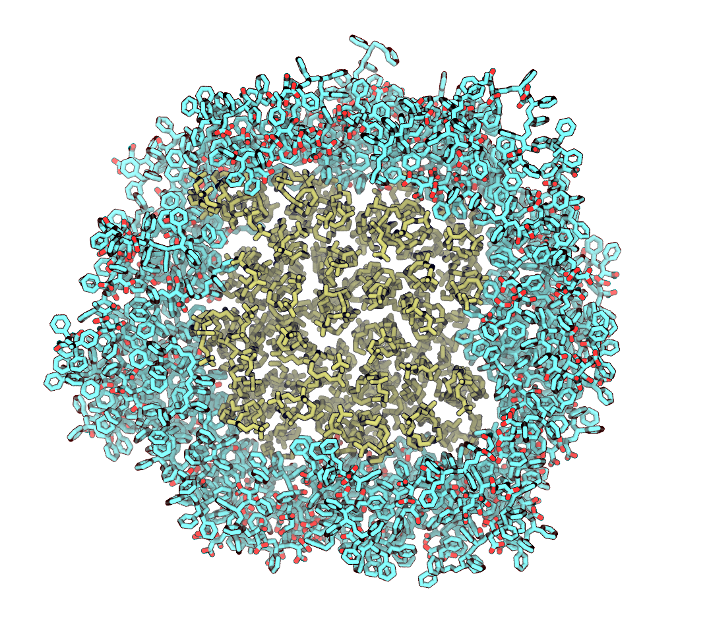

# Description

Simulation is carried out in vacuum. During the simulation harmonic potentials are applied on distances between COMs of each polymer and COM of membrane and they are only applied when these distances are more than *R* nm. Position restraints are applied on lipids to keep membrane integral. There are two virtual walls in z=0 nm and z=8 nm (approximately 2 nm higher and lower the choline groups of lipids) to keep polymers in plane of membrane (stored in *wall_atomtype.atp*).

### Generate topology
```
gmx pdb2gmx -f lipodisk.pdb -o lipodisk_processed.gro -ff oplsaa_lipids_polymers -water spce -p topol.top
```
### Move posres and itp to their own folders and define where to find them
```
for name in `ls topol_*`
do
sed -i -- 's/\#include \"posre_/\#include \"..\/posres\/posre_/g' $name
done
sed -i -- 's/\#include \"topol_/\#include \"itp\/topol_/g' topol.top
```
### Define position restraints that will be applied during steered simulation to keep membrane integral
```
echo "#ifdef POSRES_LIPIDS" >> topol_Other*.itp
var=`ls posre_Other*.itp`
echo "#include \"../posres/$var\"" >> topol_Other*.itp
echo "#endif" >> topol_Other*.itp

mkdir posres
mkdir itp
mv posre*.itp posres/.
mv topol*.itp itp/.
```
### Set box size
```
gmx editconf -f lipodisk_processed.gro -o lipodisk_newbox.gro -d 1.0 -c -bt triclinic
```
### Prepare and run EM
```
gmx grompp -f config/minim.mdp -c lipodisk_newbox.gro -r lipodisk_newbox.gro -o lipodisk_em.tpr -p topol.top -po mdout.mdp -maxwarn 1
gmx mdrun -deffnm lipodisk_em
```
### Prepare and run short NVT equilibration
```
gmx grompp -f config/nvt.mdp -c lipodisk_em.gro -r lipodisk_em.gro -o lipodisk_nvt.tpr -p topol.top -po mdout.mdp -maxwarn 1
gmx mdrun -deffnm lipodisk_nvt
```
### Prepare index file with groups for pulling and mdp file
Option **-r** determines minimal distances (in nm) between COM of membrane and COMs of polymer molecules to apply the force. When distance are less than specified with **-r** no force is applied on that polymer molecule. The distance depends on radius of membrane - optional value is *R + 2*, where *R* is membrane radius in  nanometers. It is printed in Terminal while generating starting configuration for md as `R of membrane is .. angstroms`. In case of using *popc.pdb* provided **-r 4** is optimal.
Option **-e** defines force constant of potential, kJ mol*-1 nm*-2. Default value is 50 kJ mol*-1 nm*-2.
```
gmx make_ndx -f lipodisk_nvt.tpr<<!
q
!
python gen_index.py -i lipodisk.pdb -o index_more.ndx
cat index_more.ndx >> index.ndx
python gen_mdp.py -m config/lipodisk.mdp -i index.ndx -o config/lipodisk_flatbot.mdp -r 4 -e 50
```

### Prepare and run steered md
```
gmx editconf -f lipodisk_nvt.gro -o lipodisk_bigbox.gro -box 30 30 8 -c -bt triclinic
gmx grompp -f config/lipodisk_flatbot.mdp -c lipodisk_bigbox.gro -r lipodisk_bigbox.gro -n index.ndx -o lipodisk_flatbot.tpr -p topol.top -po mdout.mdp -maxwarn 1
gmx mdrun -deffnm lipodisk_flatbot
```
After simulation the configuration should look like this:
<p align="center">
  
</p>

### If any error occured during simulation
Errors may occur due to high velocities. Just derive last frame and start new simulation with velocities generation.
To derive frame at *N* ps use *trjconv*:
```
gmx trjconv -f lipodisk_flatbot.trr -o lipodisk_1.pdb -s lipodisk_flatbot.tpr -dump N<<!
0
!
```
Then you need to add TER in new *.pdb* file (*add_ter_between_chains.py*):
```
python add_ter_between_chains.py -i lipodisk_1.pdb -o lipodisk_ter.pdb
```
You can continue calculation with or without forces starting from extracted frame.
